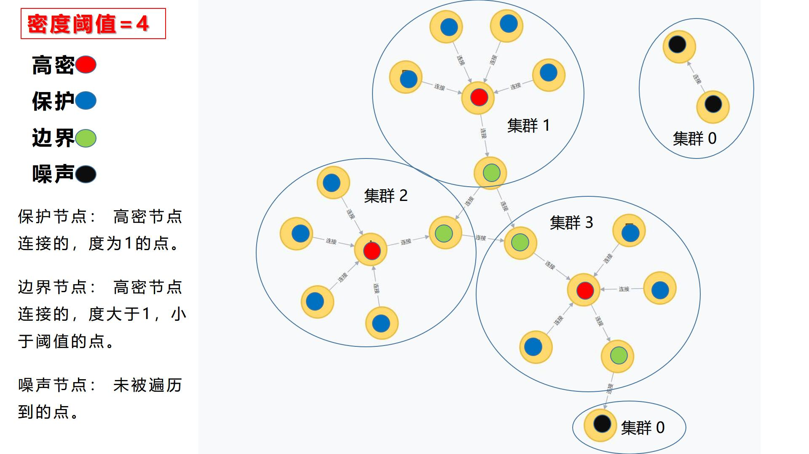
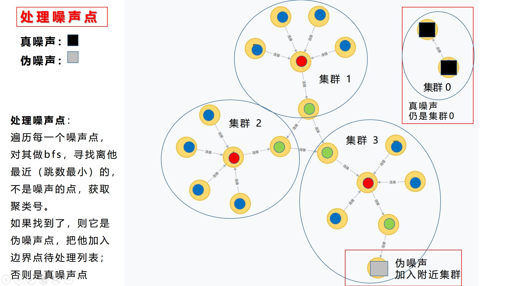
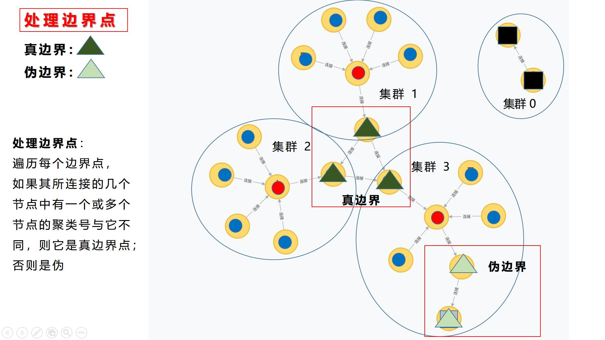

[TOC]

# 基于节点纬度的知识图谱分割

 ###  目录说明

./Database 目录存放数据集

./Neo4j 实现数据可视化

./src 为源代码目录，有三个文件夹：

- lib : 存放依赖项 jar包。 javacsv.jar 用于读取存储csv文件。
- Partitioning ： 存放核心代码
    - `Config.java  ` 参数、地址、资源分配
    - `Node.java`  节点类
    - `Cluster.java   ` 集群类
    - `Input_Output.java ` 输入输出相关方法
    - `Put_spo_in_hashmap.java` 读取spo三元组后提取实体和关系信息的方法
    - `Hashmap_sort.java`  将实体按照纬度排序 并存储
    - `CliqueCluster.java  ` Clique聚类算法
    - `test.java  ` 程序入口

### 环境

- `Java = "1.8.0_131"`
- `Python = "3.7"`
- `Neo4j = "3.5.0"`
- `IDE`   Java使用eclipse  ;  Python使用 Spyder
- `数据集`  使用红楼梦人物关系三元组作为真实数据集；另外还有两个自己构建的小图，用来debug。

### 演示

- 红楼梦大图如下：

- 分割后的一个最大的子图如下： 

----------------------------------

### 核心思想

##### 1. 为什么是聚类

​	对海量知识图谱进行分割，其最终目的是将一个大图分割成许多子图，并存储在一个计算机群内的不同计算节点上。子图内部关系密集，而子图间关系稀疏。这样可以在查询时减少不必要的跨计算节点查询次数。而事实上，跨子图查询正是制约分布式图存储计算性能的主要因素（因为它导致了大量的网络通信）。

​	根据这个出发点，提出：按照知识图谱中每个节点的纬度（即节点的出度+入度）进行聚类，找到一个大图中的多个密集单元，将每个密集单元作为子图的核心部分来分割大规模知识图谱。

​	显然，由于图结构的特殊性（图结构没有固定的坐标，节点之间只有相对位置，没有绝对位置，节点间的距离用跳数衡量），传统的聚类算法难以应用，因而考虑基于密度的聚类算法，如DBSCAN、CLIQUE聚类算法等。

##### 2. 对CLIQUE聚类的改进

​	最终使用CLIQUE聚类来实现。 主要困难是：传统的CLIQUE聚类需要依靠坐标点来划分网格：

​	而对于知识图谱来说，并没有一个确定的坐标点。所以并不能将知识图谱中的每个节点（实体），当做是传统clique中的一个点来处理。

​	**改进方法**： 对于知识图谱，每个节点都有自己的纬度，这个纬度就可以用来作为区分密集单元的依据。 所以可以直接跳过传统clique聚类中根据点坐标划分网格的部分，直接将知识图谱中的每个节点当做一个网格（它有自己的纬度作为网格密度），再进行密度阈值的判断以及网格的合并

​	**具体步骤：**

 	1. 遍历所有节点。
 	2. 如果遇到未访问过的高纬度节点，就标记他为visited，并new一个新的cluster，将这个高纬度节点加入。
 	3. 以它为起点开始做bfs，如果发现附近有其他高纬度节点，就标记为visited，然后把它也加入到cluster中。

##### 3. CLIQUE聚类时，BFS中对点的处理

​	将一个知识图谱中的点分为四类： 高密、边界、保护、噪声。 以下分别介绍这四类点。

- 高密节点： 即高纬度点，通过指定密度阈值，高于阈值的点都是高密点。
- 保护节点：高密节点连接的，度为1的点。
- 边界节点：高密节点连接的，度大于1，小于阈值的点。
- 噪声节点：未被遍历到的点。

​	**图1：初始知识图谱**

​	**图2：首次遍历后的标注**

​	**图3：处理噪声节点**

​	**图4：处理边界节点**

##### 4. 分割

用集群2举例：

规则：

- 每个集群存储的Node即为各个集群自己的点，不存在多存一次。
- 每个集群存储的三元组包括了跨区的点（上图中红色），以此足以作为跨区索引的依据，并且可以成功索引。
- 多个集群共享一张索引表。